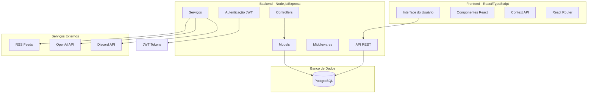
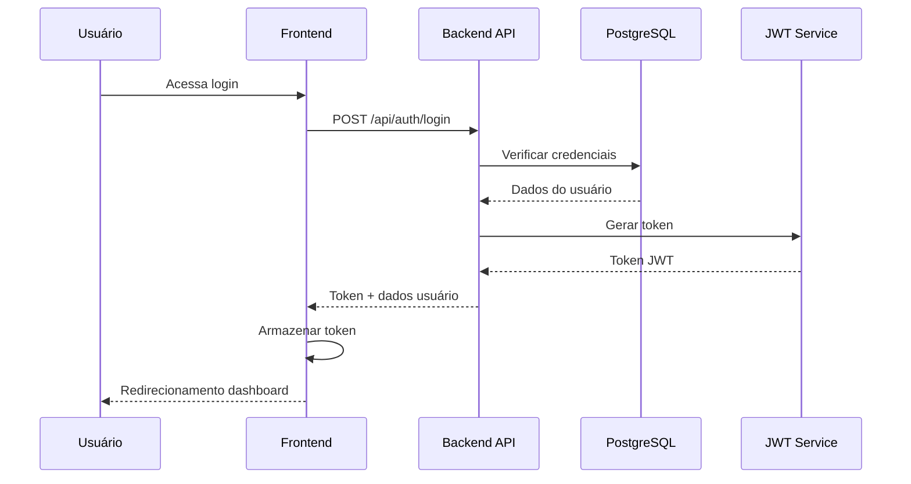
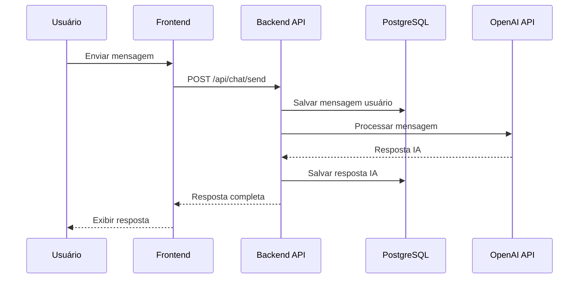
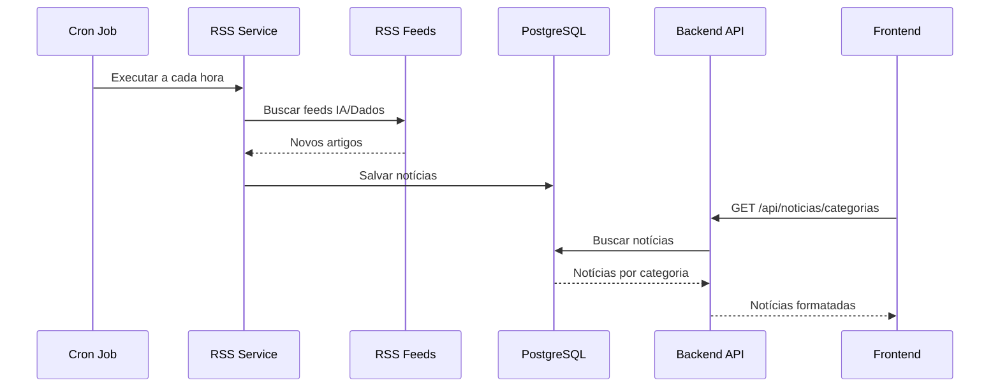
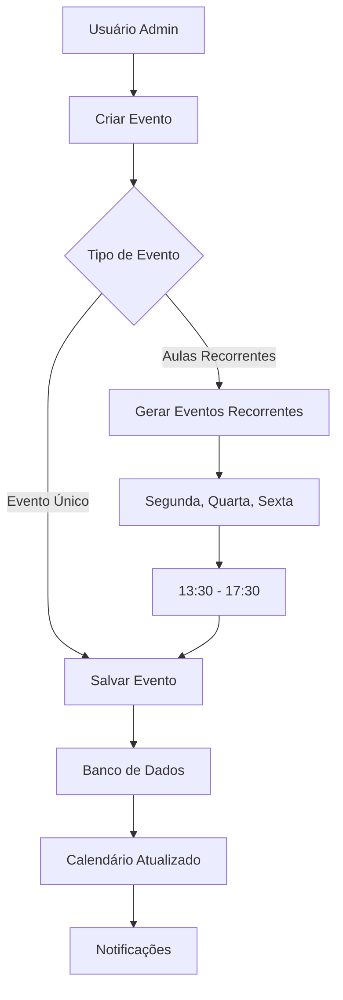
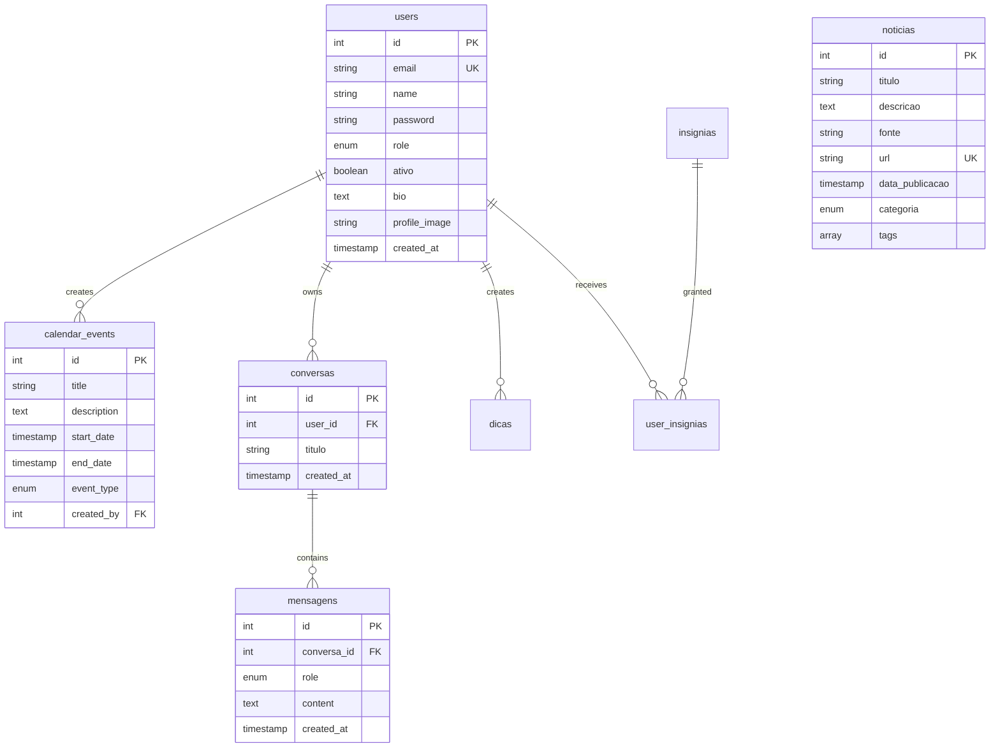

# Portal IA & Dados - Geração Caldeira

Um portal completo para a comunidade de IA e Dados da Geração Caldeira, oferecendo recursos educacionais, interação social e desenvolvimento profissional.

## 📋 Visão Geral

O Portal IA & Dados é uma plataforma full-stack desenvolvida para facilitar o aprendizado e a interação entre membros da comunidade. O sistema oferece:

- **Sistema de Autenticação JWT** com diferentes níveis de permissão
- **Painel Administrativo** para gestão de usuários e conteúdo
- **Chat com IA** para tutoria e suporte educacional
- **Sistema de Notícias** automatizado via RSS feeds
- **Calendário de Eventos** com aulas recorrentes
- **Sistema de Dicas e Tutoriais** com editor avançado
- **Sistema de Insígnias** para gamificação
- **Integração com Discord** (em desenvolvimento)
- **Fórum da Comunidade** (em desenvolvimento)

## 🏗️ Arquitetura do Sistema



## 🚀 Tecnologias Utilizadas

### Backend
- **Node.js** - Runtime JavaScript
- **Express.js** - Framework web
- **PostgreSQL** - Banco de dados relacional
- **JWT** - Autenticação e autorização
- **bcryptjs** - Hash de senhas
- **Multer** - Upload de arquivos
- **Node-cron** - Tarefas agendadas
- **RSS-Parser** - Leitura de feeds RSS
- **OpenAI** - Integração com IA
- **Axios** - Cliente HTTP

### Frontend
- **React 18** - Biblioteca de interface
- **TypeScript** - Tipagem estática
- **Vite** - Build tool
- **Tailwind CSS** - Framework CSS
- **React Router** - Roteamento
- **Framer Motion** - Animações
- **Editor.js** - Editor de texto rico
- **Lucide React** - Ícones

### DevOps & Infraestrutura
- **Docker** - Containerização
- **Docker Compose** - Orquestração
- **Nginx** - Servidor web (produção)

## 📁 Estrutura do Projeto

```
portal-ia-e-dados/
├── back/                           # Backend Node.js
│   ├── src/
│   │   ├── config/
│   │   │   └── database.js         # Configuração do banco
│   │   ├── controllers/            # Lógica de negócio
│   │   │   ├── AuthController.js
│   │   │   ├── ChatController.js
│   │   │   ├── EventoController.js
│   │   │   ├── NoticiaController.js
│   │   │   └── ...
│   │   ├── middleware/             # Middlewares
│   │   │   ├── authMiddleware.js
│   │   │   ├── adminMiddleware.js
│   │   │   └── validation.js
│   │   ├── models/                 # Modelos de dados
│   │   │   ├── UserModel.js
│   │   │   ├── ConversaModel.js
│   │   │   ├── EventoModel.js
│   │   │   └── ...
│   │   ├── routes/                 # Rotas da API
│   │   │   ├── authRoutes.js
│   │   │   ├── chatRoutes.js
│   │   │   └── ...
│   │   ├── services/               # Serviços externos
│   │   │   ├── aiService.js
│   │   │   └── rssService.js
│   │   └── server.js               # Servidor principal
│   ├── uploads/                    # Arquivos enviados
│   ├── .env                        # Variáveis de ambiente
│   ├── Dockerfile                  # Container do backend
│   └── package.json                # Dependências
├── front/                          # Frontend React
│   ├── src/
│   │   ├── components/
│   │   │   ├── features/           # Componentes por funcionalidade
│   │   │   │   ├── admin/
│   │   │   │   ├── chat/
│   │   │   │   ├── calendario/
│   │   │   │   ├── feed/
│   │   │   │   └── ...
│   │   │   ├── layout/             # Layout da aplicação
│   │   │   └── ui/                 # Componentes base
│   │   ├── contexts/               # Context API
│   │   ├── pages/                  # Páginas principais
│   │   ├── services/               # Serviços da API
│   │   └── types/                  # Tipos TypeScript
│   ├── .env                        # Variáveis do frontend
│   ├── Dockerfile                  # Container do frontend
│   └── package.json                # Dependências
├── docker-compose.yml              # Orquestração
├── deploy.sh                       # Script deploy
```

## ⚙️ Configuração e Instalação

### Pré-requisitos

- **Git** - Controle de versão
- **Docker** e **Docker Compose** - Containerização
- **Node.js 18+** (opcional, para desenvolvimento local)

### 1. Clonando o Repositório

```bash
git clone https://github.com/derik-martins/portal-ia-e-dados.git
cd portal-ia-e-dados
```

### 2. Configuração das Variáveis de Ambiente

#### Backend (.env)
Crie o arquivo `back/.env`:

```env
# Servidor
PORT=3001
HOST=0.0.0.0
NODE_ENV=production

# Banco de dados
DB_HOST=db
DB_PORT=5432
DB_NAME=geracao_caldeira_banco
DB_USER=postgres
DB_PASS=sua_senha_banco

# Autenticação
JWT_SECRET=seu_jwt_secret_muito_seguro_aqui
JWT_EXPIRES_IN=7d

# CORS
DOMAIN=localhost
CORS_ORIGIN=http://localhost:3000

# OpenAI (opcional)
OPENROUTER_API_KEY=sua_chave_openai_aqui
```

#### Frontend (.env)
Crie o arquivo `front/.env`:

```env
# URL da API
VITE_API_URL=http://localhost:3001/api
```

### 3. Instalação com Docker (Recomendado)

```bash
# Dar permissão aos scripts
chmod +x deploy.sh

# Deploy script
./deploy.sh
```

### 4. Instalação Manual (Desenvolvimento)

#### Backend
```bash
cd back
npm install
npm run dev
```

#### Frontend
```bash
cd front
npm install
npm run dev
```

#### Banco de Dados
```bash
# PostgreSQL via Docker
docker run --name postgres-gc \
  -e POSTGRES_DB=geracao_caldeira_banco \
  -e POSTGRES_USER=postgres \
  -e POSTGRES_PASSWORD=sua_senha_banco \
  -p 5432:5432 -d postgres:15-alpine
```

## 🔄 Fluxos do Sistema

### Fluxo de Autenticação



### Fluxo do Chat com IA



### Fluxo de Notícias (RSS)



### Fluxo de Gerenciamento de Eventos



## 📡 API Endpoints

### Autenticação
- `POST /api/auth/register` - Cadastrar usuário
- `POST /api/auth/login` - Fazer login
- `GET /api/auth/profile` - Obter perfil do usuário

### Usuários
- `GET /api/users` - Listar usuários (admin)
- `PUT /api/users/:id` - Atualizar usuário (admin)
- `DELETE /api/users/:id` - Excluir usuário (admin)

### Chat
- `GET /api/chat/conversas` - Listar conversas do usuário
- `GET /api/chat/conversas/:id` - Obter conversa específica
- `POST /api/chat/send` - Enviar mensagem
- `DELETE /api/chat/conversas/:id` - Excluir conversa

### Eventos
- `GET /api/eventos` - Listar eventos
- `GET /api/eventos/:id` - Obter evento específico
- `POST /api/eventos` - Criar evento (admin)
- `PUT /api/eventos/:id` - Atualizar evento (admin)
- `DELETE /api/eventos/:id` - Excluir evento (admin)
- `POST /api/eventos/recurring/classes` - Criar aulas recorrentes (admin)

### Notícias
- `GET /api/noticias` - Listar notícias
- `GET /api/noticias/categorias` - Notícias por categoria
- `POST /api/noticias/atualizar-feeds` - Atualizar feeds RSS

### Dicas
- `GET /api/dicas` - Listar dicas
- `GET /api/dicas/:id` - Obter dica específica
- `POST /api/dicas` - Criar dica (admin)
- `PUT /api/dicas/:id` - Atualizar dica (admin)
- `DELETE /api/dicas/:id` - Excluir dica (admin)

### Insígnias
- `GET /api/insignias` - Listar insígnias
- `POST /api/insignias` - Criar insígnia (admin)
- `POST /api/insignias/:id/conceder` - Conceder insígnia (admin)
- `GET /api/insignias/ranking` - Ranking de usuários

## 🔐 Sistema de Permissões

### Níveis de Usuário
- **user** - Usuário padrão
- **admin** - Administrador do sistema

### Middlewares de Segurança
- **authMiddleware** - Verificação de autenticação
- **adminMiddleware** - Verificação de permissões administrativas
- **validation** - Validação de dados de entrada

## 🗄️ Banco de Dados

### Principais Tabelas



## 🐳 Docker & Deployment

### Containers

1. **PostgreSQL** (`db`)
   - Porta: 5432
   - Dados persistentes via volume

2. **Backend** (`backend`)
   - Porta: 3001
   - Node.js + Express

3. **Frontend** (`frontend`)
   - Porta: 3000
   - React + Nginx

### Scripts de Deploy

```bash
# Deploy automático (Leia o script antes)
./deploy.sh

```

### Comandos Docker Úteis

```bash
# Ver logs
docker-compose logs -f backend
docker-compose logs -f frontend

# Reiniciar serviços
docker-compose restart backend
docker-compose restart frontend

# Acessar container
docker-compose exec backend bash
docker-compose exec db psql -U postgres -d geracao_caldeira_banco

# Backup do banco
docker-compose exec db pg_dump -U postgres geracao_caldeira_banco > backup.sql
```

## 📊 Monitoramento

### Health Checks
- Backend: `GET http://localhost:3001/health`
- Frontend: `http://localhost:3000`

### Logs
- Application logs via Docker Compose
- Database logs via PostgreSQL container
- RSS feed updates via cron jobs

### Métricas
- Número de usuários ativos
- Conversas de chat por dia
- Eventos criados
- Notícias processadas

## 🚦 Status do Projeto

### ✅ Funcionalidades Implementadas
- [x] Sistema de autenticação JWT
- [x] Painel administrativo completo
- [x] Chat com IA integrado
- [x] Sistema de eventos/calendário
- [x] Feed de notícias automatizado
- [x] Sistema de dicas com editor
- [x] Sistema de insígnias
- [x] Upload de arquivos
- [x] Perfis de usuário

### � Em Desenvolvimento
- [ ] Fórum da comunidade
- [ ] Integração Discord completa
- [ ] Sistema de notificações


## 🤝 Contribuição

Para contribuir com o projeto:

1. Fork o repositório
2. Crie uma branch para sua feature
3. Faça commit das mudanças
4. Push para a branch
5. Abra um Pull Request

**Desenvolvido com ❤️ pela Trilha de IA e Dados do Geração Caldeira 2025**
